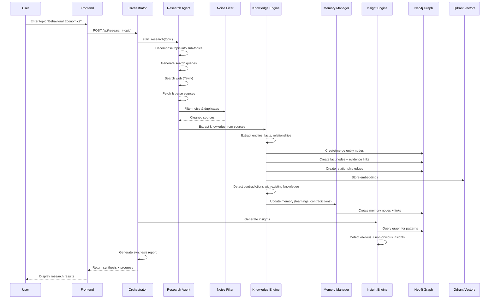
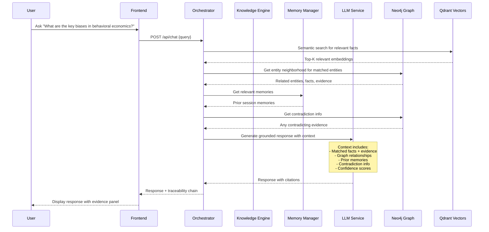
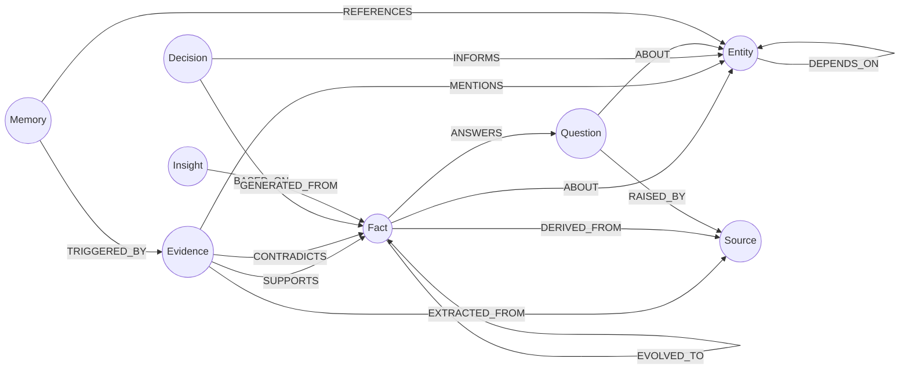
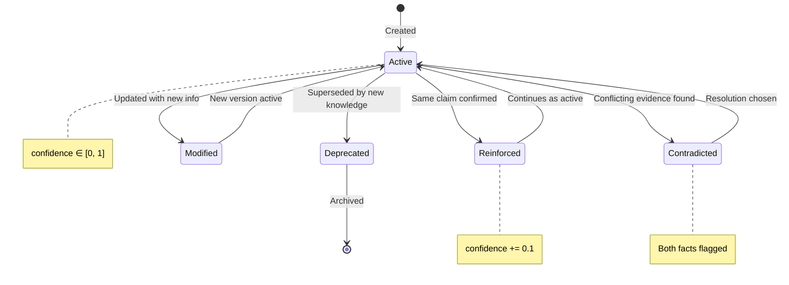

# User Intelligence Workspace — Architecture Document

## 1. System Overview

The User Intelligence Workspace is an AI-native system that acquires, structures, evolves, and utilizes knowledge over time. It supports two primary workflows: autonomous research and knowledge-augmented chat.

## 2. Architecture Diagram

```mermaid
graph TB
    subgraph "Client Layer"
        Browser["Browser (User)"]
    end

    subgraph "Frontend — Next.js 14 on Vercel"
        ResearchUI["Research Mode UI"]
        ChatUI["Chat UI"]
        GraphUI["Knowledge Graph Explorer"]
        UploadUI["File Upload"]
        TraceUI["Traceability Panel"]
        APIRoutes["Next.js API Routes (Proxy)"]
    end

    subgraph "Backend — FastAPI on Railway"
        direction TB
        
        subgraph "API Layer"
            ResearchAPI["POST /api/research"]
            ChatAPI["POST /api/chat"]
            UploadAPI["POST /api/upload"]
            GraphAPI["GET /api/graph"]
            KnowledgeAPI["GET /api/knowledge"]
        end
        
        subgraph "Service Layer"
            Orchestrator["Workflow Orchestrator"]
            ResearchAgent["Research Agent"]
            KnowledgeEngine["Knowledge Engine"]
            MemoryManager["Memory Manager"]
            InsightEngine["Insight Engine"]
            NoiseFilter["Noise Filter"]
            LLMService["LLM Service"]
        end
        
        subgraph "Ingestion Layer"
            IngestionRouter["Ingestion Router"]
            PDFProc["PDF Processor"]
            DOCXProc["DOCX Processor"]
            XLSXProc["XLSX Processor"]
            ImageProc["Image Processor"]
            AudioProc["Audio Processor"]
            VideoProc["Video Processor"]
            URLProc["URL Processor"]
            YouTubeProc["YouTube Processor"]
        end
        
        subgraph "Data Access Layer"
            GraphService["Graph Service"]
            VectorService["Vector Service"]
            PostgresService["PostgreSQL Service"]
        end
    end

    subgraph "Storage Layer"
        Neo4j["Neo4j Aura<br/>Knowledge Graph"]
        Qdrant["Qdrant Cloud<br/>Vector Store"]
        Postgres["PostgreSQL (Supabase)<br/>Sessions & Memory"]
    end

    subgraph "External APIs"
        OpenAI["OpenAI / Gemini<br/>LLM API"]
        Tavily["Tavily<br/>Web Search"]
        Whisper["Whisper<br/>Audio Transcription"]
    end

    Browser --> ResearchUI
    Browser --> ChatUI
    Browser --> GraphUI
    Browser --> UploadUI
    
    ResearchUI --> APIRoutes
    ChatUI --> APIRoutes
    UploadUI --> APIRoutes
    GraphUI --> APIRoutes
    
    APIRoutes --> ResearchAPI
    APIRoutes --> ChatAPI
    APIRoutes --> UploadAPI
    APIRoutes --> GraphAPI
    
    ResearchAPI --> Orchestrator
    ChatAPI --> Orchestrator
    UploadAPI --> IngestionRouter
    GraphAPI --> GraphService
    
    Orchestrator --> ResearchAgent
    Orchestrator --> KnowledgeEngine
    Orchestrator --> MemoryManager
    Orchestrator --> InsightEngine
    
    ResearchAgent --> Tavily
    ResearchAgent --> LLMService
    ResearchAgent --> NoiseFilter
    
    KnowledgeEngine --> GraphService
    KnowledgeEngine --> VectorService
    KnowledgeEngine --> LLMService
    
    MemoryManager --> PostgresService
    MemoryManager --> GraphService
    
    InsightEngine --> GraphService
    InsightEngine --> VectorService
    InsightEngine --> LLMService
    
    NoiseFilter --> LLMService
    
    IngestionRouter --> PDFProc
    IngestionRouter --> DOCXProc
    IngestionRouter --> XLSXProc
    IngestionRouter --> ImageProc
    IngestionRouter --> AudioProc
    IngestionRouter --> VideoProc
    IngestionRouter --> URLProc
    IngestionRouter --> YouTubeProc
    
    AudioProc --> Whisper
    VideoProc --> Whisper
    YouTubeProc --> Whisper
    ImageProc --> OpenAI
    
    GraphService --> Neo4j
    VectorService --> Qdrant
    PostgresService --> Postgres
    LLMService --> OpenAI
```

## 3. Data Flow Diagrams

### 3.1 Research Mode Flow

### 3.2 Knowledge-Augmented Chat Flow

## 4. Knowledge Graph Schema

> **Note**: All nodes carry a `topic` property for domain scoping. Evidence→Fact uses `CONTRADICTS`; Fact→Fact uses `FACT_CONTRADICTS` to avoid Cypher ambiguity.

## 5. Knowledge Evolution State Machine

## 6. API Design

### Research Endpoints
| Method | Path | Description |
|--------|------|-------------|
| `POST` | `/api/research` | Start autonomous research on a topic |
| `GET` | `/api/research/{session_id}/stream` | **SSE stream** of research progress events |
| `GET` | `/api/research/{session_id}/progress` | Get current progress (polling fallback) |
| `GET` | `/api/research/{session_id}/synthesis` | Get research synthesis |

### Chat Endpoints
| Method | Path | Description |
|--------|------|-------------|
| `POST` | `/api/chat` | Send a chat message → **SSE stream** of response tokens |
| `GET` | `/api/chat/{session_id}/history?page=1&limit=20` | Get paginated chat history |

> Chat POST body: `{session_id, query, conversation_id}` — includes session context for follow-ups.

### Knowledge Endpoints
| Method | Path | Description |
|--------|------|-------------|
| `GET` | `/api/knowledge/entities?topic=X&page=1&limit=20` | List entities (paginated, filterable) |
| `GET` | `/api/knowledge/facts?status=active&confidence_min=0.5&topic=X` | List facts (paginated, filterable) |
| `GET` | `/api/knowledge/facts/{id}/trace` | Get full traceability chain |
| `GET` | `/api/knowledge/decisions?topic=X` | List decisions |
| `GET` | `/api/knowledge/decisions/{id}/trace` | Get decision traceability |
| `GET` | `/api/knowledge/questions?status=open&topic=X` | List open questions |
| `GET` | `/api/knowledge/contradictions?topic=X` | List all contradictions |
| `GET` | `/api/knowledge/stats?topic=X` | Knowledge base statistics |

### Graph Endpoints
| Method | Path | Description |
|--------|------|-------------|
| `GET` | `/api/graph?topic=X&limit=200` | Get graph for visualization |
| `GET` | `/api/graph/entity/{id}/neighborhood?depth=2` | Get entity neighborhood |
| `GET` | `/api/graph/search?q=term&topic=X` | Search entities/facts |

### Upload Endpoints
| Method | Path | Description |
|--------|------|-------------|
| `POST` | `/api/upload` | Upload a document for processing |
| `POST` | `/api/upload/batch` | Upload multiple documents |
| `GET` | `/api/upload/{id}/status` | Get processing status |

### Memory Endpoints
| Method | Path | Description |
|--------|------|-------------|
| `GET` | `/api/memory/sessions?page=1&limit=20` | List all sessions (paginated) |
| `GET` | `/api/memory/{session_id}` | Get session memories |
| `GET` | `/api/memory/evolution/{id}` | Get memory evolution history |

## 7. Non-Functional Requirements

### Performance
- Research pipeline completes in < 5 minutes for a standard topic
- Chat first token in < 2 seconds (streaming)
- Chat full response in < 10 seconds
- Graph visualization loads in < 3 seconds
- Document upload processing feedback within 1 second

### Streaming
- Research progress: SSE with `text/event-stream` content type
- Chat responses: SSE with token-by-token streaming
- Frontend uses `EventSource` API (native browser support)
- Fallback: polling endpoints for environments without SSE

### Reliability
- Graceful degradation: if web search fails, use existing knowledge
- Retry logic with exponential backoff on all external API calls
- No data loss on pipeline failure (atomic operations where possible)
- PostgreSQL ensures data persistence across container restarts

### Security
- API keys stored as environment variables, never committed
- CORS restricted to frontend domain
- File upload size limits and type validation
- No PII stored in knowledge graph
- Bearer token authentication on all endpoints

### Scalability Considerations
- Single-user design (sufficient for assessment)
- Neo4j Aura free tier: 200K nodes (enough for research workspace)
- Qdrant free tier: 1GB (thousands of embeddings)
- PostgreSQL (Supabase free tier): 500MB
- Future: could add Redis for caching, Celery for task queues

