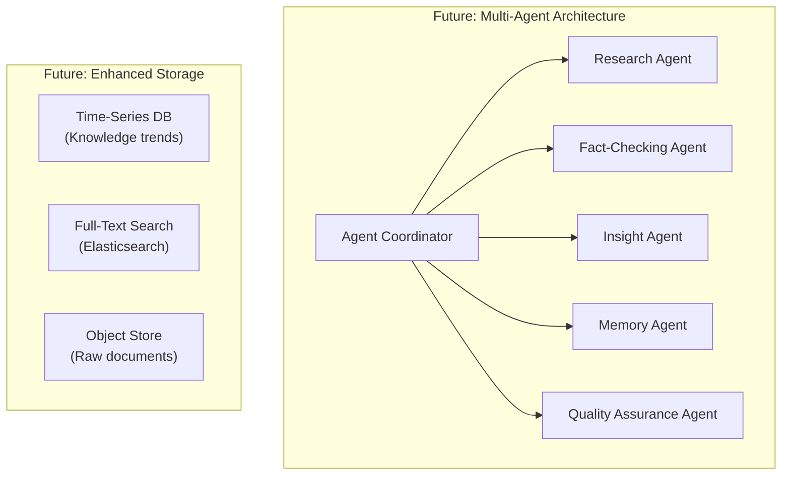

# User Intelligence Workspace — Design Document

## 1. Introduction

### 1.1 Purpose
This document describes the design decisions, trade-offs, and rationale behind the User Intelligence Workspace — a single-user AI-native system for autonomous research and knowledge-augmented chat.

### 1.2 Scope
Covers the entire system: knowledge graph design, memory architecture, research pipeline, insight generation, document ingestion, explainability framework, and deployment strategy.

### 1.3 Audience
Evaluators assessing system design, knowledge quality, and reasoning capability.

---

## 2. Design Philosophy

### 2.1 Knowledge-First, Not Feature-First
The system is designed around **knowledge quality** rather than feature count. Every architectural decision optimizes for:
- Structured, traceable knowledge
- Evidence-backed responses
- Knowledge that evolves, not just accumulates
- Insights that go beyond surface-level extraction

### 2.2 Graph + Vector: Complementary, Not Competing
The dual-store architecture (Neo4j + Qdrant) is intentional:
- **Vector store** excels at: "What content is semantically similar to X?"
- **Knowledge graph** excels at: "What contradicts X?", "What depends on X?", "How did X evolve?"
- Together, they provide capabilities neither can achieve alone

### 2.3 Autonomy with Transparency
The research pipeline is autonomous (no step-by-step user guidance), but every decision is explainable:
- Why a source was included or excluded
- Why a fact was flagged as contradicting
- Why confidence changed
- What evidence supports each claim

---

## 3. Key Design Decisions

### 3.1 Knowledge Graph Implementation: Neo4j

**Decision**: Use Neo4j Aura (cloud) over in-memory graph libraries (NetworkX) or embedded databases.

**Rationale**:
| Factor | Neo4j | NetworkX | SQLite with JOINs |
|--------|-------|----------|-------------------|
| Persistence | ✅ Cloud-native | ❌ In-memory only | ✅ File-based |
| Query Language | ✅ Cypher (expressive) | ❌ Python API only | ⚠️ SQL (awkward for graphs) |
| Path Queries | ✅ Native | ⚠️ Manual BFS/DFS | ❌ Recursive CTEs |
| Contradiction Detection | ✅ Pattern matching | ⚠️ Manual | ❌ Very complex |
| Visualization | ✅ Native browser | ❌ External libs | ❌ Not supported |
| Free Tier | ✅ 200K nodes | ✅ Unlimited | ✅ Unlimited |

**Trade-off**: Adds external dependency, but the query expressiveness for contradiction detection and relationship exploration far outweighs the complexity cost.

### 3.2 Memory Architecture: Evolving, Not Accumulating

**Decision**: Memories have lifecycle states (`active → reinforced → modified → contradicted → deprecated`) rather than being append-only logs. PostgreSQL is the single source of truth, with Qdrant for semantic search and Neo4j for graph relationships.

**Rationale**:
- The assignment explicitly requires: "Memory should evolve. Memory should not merely accumulate."
- Append-only logs create noise over time — the system can't distinguish current truth from historical artifacts
- Lifecycle states allow the system to present "what we currently believe" vs. "what we used to believe"

**Implementation**:
- `memories` table in PostgreSQL is the authoritative source
- Memories are embedded in Qdrant `memory_embeddings` for semantic retrieval
- Each memory links to the knowledge graph nodes it references via Neo4j `:Memory` nodes
- Evolution creates `EVOLVED_TO` edges, preserving history
- The `memory_evolution_log` table provides full audit trail
- `superseded_by` field chains memory versions

### 3.2b Document Chunking Strategy

**Decision**: All documents are chunked (semantic or fixed-size) before LLM extraction.

**Rationale**:
- LLM context limits prevent full-document processing
- Focused chunks improve extraction quality and reduce hallucination
- Each chunk becomes an Evidence node, allowing precise traceability back to the exact location in the source

### 3.2c Conversation Context for Chat

**Decision**: Chat sessions maintain conversational context in PostgreSQL for follow-up resolution.

**Rationale**:
- A user asking "What about that?" requires the system to resolve the anaphoric reference.
- Storing recent chat messages allows the system to expand follow-up queries before retrieval.

### 3.3 Noise Rejection: LLM-Judged, Not Rule-Based

**Decision**: Use LLM assessment for noise filtering rather than heuristic rules.

**Rationale**:
- Topic-agnostic: the system handles any domain (economics, space, chocolate)
- Rule-based filters (keyword matching, length thresholds) produce false positives
- LLM can assess: relevance to topic, information density, credibility signals
- Every rejection is explained ("excluded because: mostly marketing content with no factual claims")

**Trade-off**: Higher LLM cost per source, but quality justifies the cost. We use a cheaper model (GPT-4o-mini) for noise filtering and reserve GPT-4o for knowledge extraction.

### 3.4 Dual Retrieval: Graph Context + Vector Similarity

**Decision**: Chat responses use BOTH graph traversal AND vector similarity search.

**Rationale**:
```
User asks: "What are the main criticisms of nudge theory?"

Vector Search alone → finds relevant text chunks about nudge theory
Graph Search adds  → finds CONTRADICTS edges, alternative viewpoints,
                      evidence from opposing sources, confidence levels,
                      related entities (behavioral economics, libertarian paternalism)
Combined           → grounded response with pro/con evidence, citations, confidence
```

**Implementation**:
1. Query Router classifies intent (factual, relational, comparative, contradictions)
2. Vector search finds top-K relevant facts/evidence/memories
3. For matched entities, traverse graph for neighborhood based on intent
4. Specifically query for `FACT_CONTRADICTS` and `SUPPORTS` relationships
5. Combine all context into LLM prompt
5. Response includes traceability chain

### 3.5 Traceability: Response → Knowledge → Evidence → Source

**Decision**: Every claim in a response must be traceable to its original source.

**Implementation**:
```
Response: "Nudge theory, developed by Thaler and Sunstein, suggests that..."
  ↓
Knowledge: Fact #42 "Nudge theory was developed by Richard Thaler and Cass Sunstein"
  Confidence: 0.95 | Sources: 5 | Status: Active
  ↓
Evidence: "In their 2008 book 'Nudge', Thaler and Sunstein proposed..."
  Type: direct_quote | Source: Behavioral Economics Review
  ↓
Source: URL: https://example.com/behavioral-economics-review
  Type: web | Quality: 0.85 | Ingested: 2024-01-15
```

The frontend displays this chain in a collapsible traceability panel alongside the response.

---

## 4. Insight Generation Design

### 4.1 Two-Tier Insight Model

**Obvious Insights** (extracted from sources):
- Strategy: Direct extraction from source content
- LLM prompt asks for: facts, decisions, risks, themes, conclusions
- High confidence, well-evidenced

**Non-Obvious Insights** (inferred from accumulated knowledge):
- Strategy: Graph analysis + cross-referencing + LLM synthesis
- Methods:
  1. **Contradiction detection**: Graph `CONTRADICTS` edges
  2. **Pattern recognition**: Entities appearing across many facts (hub nodes)
  3. **Weak signal detection**: Low-confidence facts corroborated by multiple sources
  4. **Bridge entity discovery**: Entities connecting otherwise separate knowledge clusters
  5. **Temporal emergence**: Topics with increasing mention frequency across sessions

### 4.2 Why This Satisfies the Assessment

The assignment asks: *"The graph should support at least one capability that would be difficult to achieve using vector retrieval alone."*

Our graph enables:
1. **Contradiction detection** — finding facts with both SUPPORTS and FACT_CONTRADICTS edges
2. **Influence mapping** — traversing INFLUENCES edges transitively
3. **Dependency discovery** — following DEPENDS_ON chains
4. **Knowledge evolution tracking** — following EVOLVED_TO paths to see how a fact changed
5. **Bridge entity detection** — finding nodes with high betweenness centrality
6. **Decision/Question tracing** — following BASED_ON and ANSWERS edges to connect decisions to facts

None of these are achievable with vector similarity search alone.

---

## 5. Incremental Learning Design

### 5.1 Problem
Adding new information should NOT require rebuilding the knowledge graph from scratch.

### 5.2 Solution: Entity Resolution + Fact Evolution

```
New document arrives
    │
    ▼
Extract entities & facts
    │
    ▼
For each entity:
    ├── Search Neo4j by name + embedding similarity
    ├── If match found (>0.85 similarity) → Merge (update metadata, add evidence)
    └── If no match → Create new entity node
    
For each fact:
    ├── Search existing facts about the same entities
    ├── Classify relationship (LLM): reinforce / modify / contradict / deprecate / unrelated
    ├── Apply appropriate evolution action
    └── Update vector store (upsert)
```

### 5.3 Why This Matters
- The 5th document about "behavioral economics" should ENRICH the graph, not create duplicates
- Confidence scores increase as facts are confirmed across sources
- Contradictions are explicitly detected and surfaced

---

## 6. Response Quality Design

### 6.1 Response Format
All responses use structured formatting:
- **Headings** for major sections
- **Tables** for comparative information
- **Bullets** for lists
- **Citations** inline with `[Source: title]` notation
- **Confidence indicators** (🟢 High | 🟡 Medium | 🔴 Low)
- **Evidence sections** listing supporting/contradicting evidence
- **Relationship summaries** showing how entities connect

### 6.2 Decision-Quality Communication
The goal is: *"Decision-quality communication, not raw LLM output."*

This means:
- No vague claims without evidence
- No confident tone for low-confidence facts
- Always show what supports AND what contradicts
- Present trade-offs, not single perspectives
- Quantify where possible (X sources, Y confidence)

---

## 7. What Remains Unfinished

| Area | Status | What's Missing |
|------|--------|---------------|
| Multi-language | Not implemented | Only English content processing |
| Collaborative | Not applicable | Single-user design |
| Advanced OCR | Basic | Complex table/chart extraction from images |
| Knowledge decay | Not implemented | Time-based confidence degradation |

## 8. What We Would Improve

1. **Graph community detection** — Use Neo4j GDS for automated clustering
2. **Embedding fine-tuning** — Train domain-specific embeddings for better retrieval
3. **Async task queue** — Celery/Redis for research pipeline (currently synchronous)
4. **Caching layer** — Redis for frequently accessed graph queries
5. **Knowledge conflict resolution UI** — Let users manually resolve contradictions
6. **Multi-modal knowledge** — Store and query image/chart knowledge natively

## 9. Technical Debt

1. No rate limiting on API — vulnerable to abuse in production
2. Hard-coded LLM prompts — should be templated and version-controlled
3. No embedding model versioning — re-embedding needed if model changes

## 10. Scaling Concerns

1. **Neo4j Aura free tier**: 200K nodes sufficient for assessment, paid tier for production
2. **LLM API costs**: ~$2-5 per research session (GPT-4o); budget-constrained
3. **Vector store size**: 1GB free tier = ~500K embeddings; adequate for single-user
4. **Concurrent research**: Current design processes one topic at a time
5. **Memory growth**: Need memory pruning/summarization for very long-lived workspaces

## 11. Knowledge Quality Concerns

1. **LLM hallucination in extraction**: Mitigated by requiring evidence links, but not eliminated
2. **Source quality assessment**: Currently heuristic-based; could use authority scoring
3. **Confidence calibration**: Scores are relative, not calibrated to actual accuracy
4. **Cross-domain knowledge**: Entity resolution may incorrectly merge entities with same name in different domains
5. **Temporal validity**: Facts may become outdated; no automatic freshness checking

## 12. Future Architecture



The natural evolution is toward a **multi-agent architecture** where specialized agents handle research, fact-checking, insights, and quality assurance independently, coordinated by a central orchestrator.
